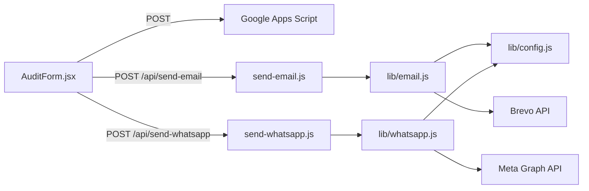

# BeBeyond Event Form

Production-ready lead capture app for **BeBeyond Digital**. Built with Vite + React on the frontend and **Vercel serverless functions** for email and WhatsApp—no Express, NestJS, or separate Node server.

## Features

- Multi-step audit request form with client-side validation
- Google Sheets lead storage via Apps Script webhook
- Customer + admin transactional emails via **Brevo API v3**
- Post-submit WhatsApp template message via **Meta Cloud API**
- Server-side secrets only (no API keys in frontend bundle)
- Scoped environment validation (`email` vs `whatsapp`)
- WhatsApp failures are non-blocking (form still succeeds)

---

## Architecture



| Layer | Responsibility |
|--------|----------------|
| `src/components/AuditForm.jsx` | UI, validation, orchestration |
| `api/send-email.js` | HTTP handler for Brevo emails |
| `api/send-whatsapp.js` | HTTP handler for WhatsApp templates |
| `lib/config.js` | Centralized, scoped env validation |
| `lib/email.js` | `validateEmail()`, `sendBrevoEmail()` |
| `lib/whatsapp.js` | `formatIndianWhatsAppNumber()`, `sendWhatsAppTemplate()` |

---

## Project Structure

```txt
.
├─ api/
│  ├─ send-email.js       # Vercel serverless route
│  └─ send-whatsapp.js    # Vercel serverless route
├─ lib/
│  ├─ config.js           # getConfig('email' | 'whatsapp' | 'all')
│  ├─ email.js            # Brevo helpers
│  └─ whatsapp.js         # Meta WhatsApp helpers
├─ src/
│  ├─ components/
│  │  └─ AuditForm.jsx
│  ├─ App.jsx
│  └─ main.jsx
├─ .env.example
├─ vercel.json
├─ vite.config.js
└─ package.json
```

---

## Submission Flow

On successful form submit (`AuditForm.jsx`):

1. **Google Sheet** — `POST` to `VITE_GOOGLE_SHEET_URL` (opaque `no-cors` response)
2. **Customer email** — `POST /api/send-email` with recipient from form
3. **Admin email** — `POST /api/send-email` with `audience: "admin"` (recipient from `MAIL_ADMIN_EMAIL` on server)
4. **WhatsApp** — `POST /api/send-whatsapp` (errors logged; success UI still shown)

---

## Environment Variables

Copy the example file and fill in real values:

```bash
cp .env.example .env.local
```

### Frontend (safe to expose — `VITE_` prefix)

| Variable | Description |
|----------|-------------|
| `VITE_GOOGLE_SHEET_URL` | Google Apps Script web app URL (`/exec`) |

The frontend reads **only** this variable. All email/WhatsApp credentials stay server-side.

### Email — Brevo (server-side only)

| Variable | Required | Description |
|----------|----------|-------------|
| `BREVO_API_KEY` | Yes | Brevo API key (`xkeysib-...`) |
| `MAIL_FROM_EMAIL` | Yes | Verified sender email in Brevo |
| `MAIL_FROM_NAME` | Yes | Sender display name |
| `MAIL_ADMIN_EMAIL` | Yes | Admin notification inbox |

### WhatsApp — Meta Cloud API (server-side only)

| Variable | Required | Description |
|----------|----------|-------------|
| `WHATSAPP_ACCESS_TOKEN` | Yes | Permanent or system user token |
| `WHATSAPP_PHONE_NUMBER_ID` | Yes | Phone number ID from Meta |
| `WHATSAPP_BUSINESS_ACCOUNT_ID` | Yes | WABA ID (validated at startup) |
| `WHATSAPP_TEMPLATE_NAME` | Yes | Approved template name |
| `WHATSAPP_API_VERSION` | No | Default: `v20.0` |
| `WHATSAPP_LANGUAGE_CODE` | No | Default: `en` |

### Removed (do not use)

These were removed when migrating from MailerSend:

- `MAILERSEND_API_KEY`
- `MAILERSEND_FROM_EMAIL`
- `MAILERSEND_FROM_NAME`
- `MAILERSEND_ADMIN_EMAIL`
- `VITE_MAILERSEND_*`
- `VITE_ADMIN_EMAIL`

---

## API Reference

### `POST /api/send-email`

Sends transactional email via [Brevo SMTP API v3](https://developers.brevo.com/reference/sendtransacemail).

**Customer email**

```json
{
  "to_email": "customer@example.com",
  "to_name": "Rahul Sharma",
  "subject": "Audit Request Received",
  "html": "<p>Thank you...</p>"
}
```

**Admin email** (recipient resolved server-side)

```json
{
  "audience": "admin",
  "subject": "New Audit Lead — My Brand",
  "html": "<p>Lead details...</p>"
}
```

**Validation**

- `to_email` — valid email (or omitted when `audience: "admin"`)
- `subject` — 3–200 characters
- `html` — 20–200,000 characters

**Success response**

```json
{
  "ok": true,
  "message": "Email sent successfully.",
  "data": {
    "audience": "customer",
    "to_email": "customer@example.com",
    "message_id": "..."
  }
}
```

**Error response**

```json
{
  "ok": false,
  "error": {
    "code": "INVALID_EMAIL",
    "message": "A valid recipient email is required."
  },
  "details": null
}
```

---

### `POST /api/send-whatsapp`

Sends an approved WhatsApp template to the submitted mobile number.

**Request body**

```json
{
  "mobile": "9876543210",
  "name": "Rahul Sharma",
  "businessName": "My Brand",
  "auditType": "Instagram + Website"
}
```

**Behavior**

- Mobile normalized to `91XXXXXXXXXX` (10-digit Indian number)
- Template body parameters (in order): `name`, `businessName`, `auditType`
- Language from `WHATSAPP_LANGUAGE_CODE` (default `en`)
- Graph API version from `WHATSAPP_API_VERSION` (default `v20.0`)

**Success response**

```json
{
  "ok": true,
  "message": "WhatsApp template sent successfully.",
  "data": {
    "to": "919876543210",
    "business_account_id": "...",
    "api_version": "v20.0",
    "language_code": "en"
  }
}
```

---

## Local Development

### Install and run frontend

```bash
npm install
npm run dev
```

`npm run dev` starts the Vite frontend only. **Serverless routes (`/api/*`) are not available** unless you use Vercel’s dev server.

### Full stack locally (recommended)

Install the [Vercel CLI](https://vercel.com/docs/cli), link the project, and run:

```bash
npx vercel dev
```

Load env vars from `.env.local` (or pull from Vercel):

```bash
npx vercel env pull .env.local
```

### Other scripts

```bash
npm run build    # Production build
npm run preview  # Preview dist/
npm run lint     # ESLint
```

---

## Vercel Deployment

1. Push the repository to GitHub/GitLab/Bitbucket.
2. Import the project in [Vercel](https://vercel.com).
3. **Settings → Environment Variables** — add every variable from `.env.example` for Production (and Preview if needed).
4. Deploy. Vercel automatically deploys `api/*.js` as serverless functions.
5. Confirm routes after deploy:
   - `https://<your-domain>/api/send-email`
   - `https://<your-domain>/api/send-whatsapp`

**Important**

- Redeploy after changing environment variables.
- `VITE_*` variables must be set at **build time** for the frontend bundle.
- Email and WhatsApp env vars are read at **runtime** in serverless functions only.
- Email and WhatsApp configs are validated independently—missing WhatsApp vars will not break the email route.

---

## WhatsApp Template Setup

Your Meta template must match what `lib/whatsapp.js` sends:

- **Type:** Utility/Marketing (as approved)
- **Body variables (3):** customer name, business name, audit type
- **Language code:** must match `WHATSAPP_LANGUAGE_CODE` (e.g. `en` or `en_US` per Meta)

Example template body:

```text
Hi {{1}}, we received your audit request for {{2}} ({{3}}). Our team will respond within 24 hours.
```

---

## Brevo Setup

1. Create a Brevo account and generate an API key.
2. Verify your sender domain/email (`MAIL_FROM_EMAIL`).
3. Set `BREVO_API_KEY`, `MAIL_FROM_EMAIL`, `MAIL_FROM_NAME`, and `MAIL_ADMIN_EMAIL` in Vercel.
4. Test with a form submission and check Brevo transactional logs.

---

## Testing Checklist

### Happy path

- [ ] Form submits without validation errors
- [ ] New row in Google Sheet
- [ ] Customer receives Brevo email
- [ ] Admin receives Brevo email
- [ ] WhatsApp template arrives on `+91` number
- [ ] Success screen is shown

### WhatsApp failure tolerance

- [ ] Temporarily invalidate `WHATSAPP_ACCESS_TOKEN`
- [ ] Submit again — sheet + emails succeed, success UI still shown
- [ ] Check Vercel function logs for `send-whatsapp route failure`

### Email-only config

- [ ] With only Brevo env vars set, `/api/send-email` returns `200`
- [ ] Missing Brevo vars return clear `500` with config error in logs

---

## Troubleshooting

| Symptom | Likely cause | Fix |
|---------|----------------|-----|
| `500` on `/api/send-email` | Missing Brevo env vars | Set `BREVO_API_KEY`, `MAIL_FROM_*`, `MAIL_ADMIN_EMAIL`; redeploy |
| Brevo `401` / `403` | Invalid API key or unverified sender | Regenerate key; verify sender in Brevo |
| Email works locally but not on Vercel | Env not set for Production | Add vars in Vercel dashboard; redeploy |
| `Error: [object Object]` in console | Old bundle or API error object | Hard refresh; check Network → Response `error.message` |
| WhatsApp never arrives | Template/language mismatch or token | Align `WHATSAPP_TEMPLATE_NAME` and `WHATSAPP_LANGUAGE_CODE` with Meta |
| `/api/*` 404 in `npm run dev` | Vite does not run serverless routes | Use `npx vercel dev` |
| Google Sheet empty | Wrong `VITE_GOOGLE_SHEET_URL` or script permissions | Test Apps Script deploy URL manually |

View serverless logs: Vercel project → **Deployments** → select deployment → **Functions** → `send-email` / `send-whatsapp`.

---

## Security

- API keys and tokens exist only in serverless `process.env`.
- Admin email address is never exposed via `VITE_*` variables.
- Do not commit `.env`, `.env.local`, or real credentials.
- `.env.example` contains placeholders only.

---

## License

Private project — BeBeyond Digital.
